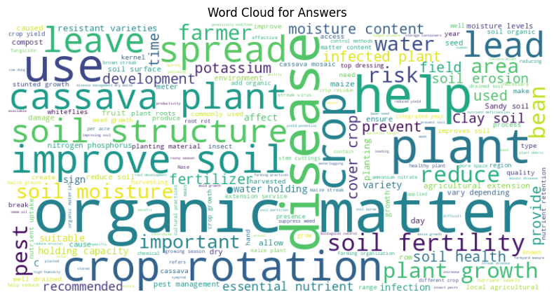
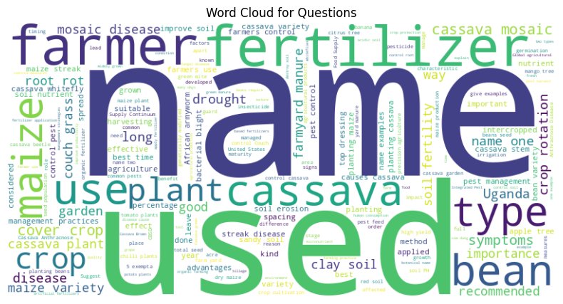
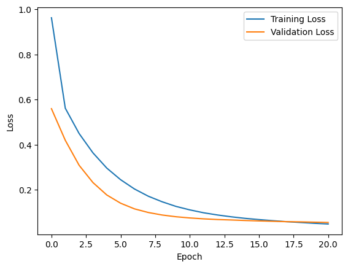
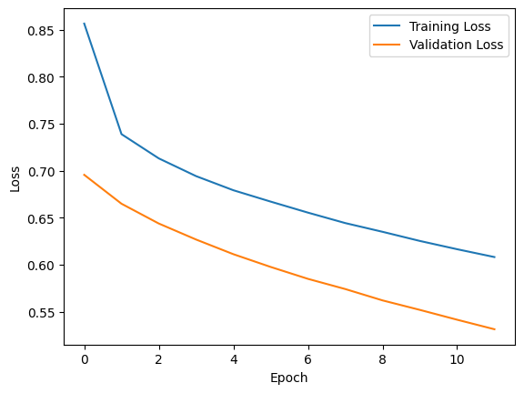
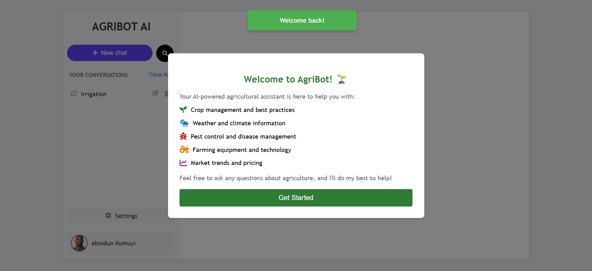
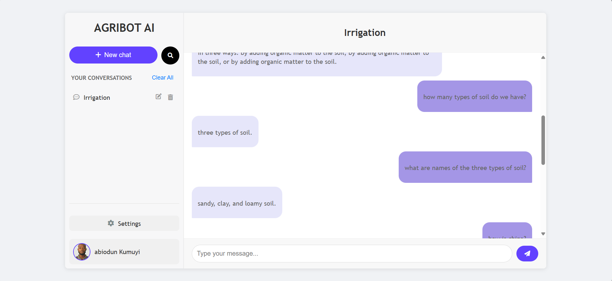
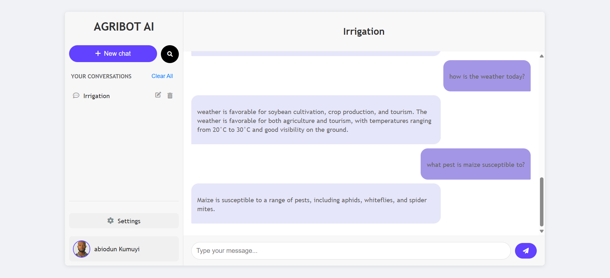

# AGRIBOT AI Application

       

## Project Overview

This repository contains the code and documentation for the AGRIBOT AI project, an agriculture domain-specific chatbot designed to provide accurate and relevant responses to farming-related queries. The project leverages a fine-tuned T5 Transformer model, utilizing the KisanVaani agriculture QA dataset [1], which consists of 22,615 English-only question-answer pairs focused on topics such as fertilizer use and crop management. The goal was to optimize model performance through extensive experimentation with various optimizers (SGD, Adam, Nadam) and hyperparameters, culminating in a Flask-based web application with features like conversation management and an upgrade system. The best-performing model, T5 with Nadam at 21 epochs, achieved a BLEU score of 0.6558 and a ROUGE score of 0.9303, though challenges such as optimizer convergence issues and resource constraints were encountered, suggesting areas for further refinement.

## Live Site

Access the live AGRIBOT AI application on Render here: [https://agribot-ai.onrender.com/](https://agribot-ai.onrender.com/)

**Important Note on Data Persistence:** This live deployment uses an ephemeral SQLite database. This means all user data (accounts, conversations, profile pictures) will be reset if the Render service restarts, rebuilds (e.g., on a new code push), or experiences a period of inactivity (especially on the free tier). Data is not persistent across sessions or deployments.

## Repository Structure

The repository is organized into the following directories and files for clarity and reproducibility:

*   `experiment_table/`: Contains experiment data and results.
    *   `DOMAIN SPECIFIC CHATBOT EXPERIMENT.xlsx`: Excel file with detailed experiment table, including performance metrics.
*   `images/`: Stores visualizations and screenshots.
    *   `adam_nadam_loss.png`, `sgd_loss.png`: Loss curves for different optimizers.
    *   `word_cloud_answer.png`, `word_cloud_question.png`: Word clouds for answers and questions.
    *   `chatbot_image0.png`, `chatbot_image1.png`, `chatbot_image2.png`: Screenshots of the chatbot interface.
*   `notebooks/`: Jupyter notebooks for model development and experimentation.
    *   `AGRIBOT.ipynb`, `AGRIBOT2.ipynb`: Notebooks detailing the chatbot development process.
*   `python_files/`: Python scripts for the chatbot.
    *   `agribot.py`, `agribot2.py`: Core implementation files.
*   `static/`: Static assets for the web application.
    *   `script.js`, `style.css`: JavaScript and CSS files for UI functionality and styling.
    *   `agribot.jpeg`: Application icon/favicon.
*   `templates/`: HTML templates for the web interface.
    *   `chat.html`, `login.html`, `signup.html`, `settings.html`, `upgrade.html`, `welcome_popup.html`: Templates for various pages.
*   `instance/`: Database storage.
    *   `site.db`: SQLite database for user data and conversations.
*   `migrations/`: Migration files for database schema changes.
    *   `alembic.ini`, `env.py`, `script.py.mako`, `README`, and `versions/`: Migration configuration and version files.
*   `__pycache__/**`: Compiled Python files.
    *   `app.cpython-39.pyc`: Cached bytecode for the application.
*   `app.py`: Main Flask application file.
*   `config.py`: Configuration settings for the application.
*   `requirements.txt`: Lists Python dependencies for reproducibility.
*   `README.md`: This file, providing an overview and instructions.

## Data Sourcing

The dataset used in this project is sourced from the KisanVaani agriculture QA dataset [1], available on Hugging Face. The files are integrated into the project workflow via the Jupyter notebooks and Python scripts, with no separate data directory required as the dataset is dynamically loaded during execution.



## Setup Instructions

To set up the environment and run the AGRIBOT AI chatbot, follow these steps:

1.  **Clone the Repository:**
    Run the following command in your terminal to clone the repository:
    ```bash
    git clone https://github.com/eobolo/AGRIBOT-AI.git
    ```

2.  **Install Dependencies:**
    Ensure you have Python 3.9+ installed.
    Install required packages using the provided `requirements.txt`:
    ```bash
    pip install -r requirements.txt
    ```
    The `requirements.txt` includes:
    *   `Flask`
    *   `Flask-SQLAlchemy`
    *   `Flask-Login`
    *   `requests`
    *   `Werkzeug`
    *   `Flask-Migrate`
    *   `python-dotenv`
    *   `tensorflow`
    *   `transformers`
    *   `datasets`
    *   `evaluate`
    *   `streamlit`
    *   `rouge_score`
    *   `numpy`
    *   `pandas`
    *   `matplotlib`

3.  **Perform Database Migrations:**
    Since the application uses `Flask-Migrate` for database schema management, you need to apply the migrations after setting up the environment. Navigate to your project's root directory in your terminal and run:
    ```bash
    flask db init
    flask db migrate -m "Initial migration or descriptive message for changes"
    flask db upgrade
    ```
    *   **Troubleshooting `ImportError: Can't find Python file migrations\env.py` or `Error: Directory migrations already exists and is not empty`:**
        1.  **Stop your Flask server.**
        2.  **Delete the existing `migrations` directory:**
            (Use this command carefully and ensure you are in the correct project root directory. This will delete all contents within `migrations`.)
        3.  **Re-run the `flask db init`, `flask db migrate`, and `flask db upgrade` commands** as listed above.

4.  **Run the Chatbot:**
    Navigate to the repository directory:
    ```bash
    cd AGRIBOT-AI
    ```
    Execute the Flask application:
    ```bash
    python app.py
    ```
    Access the web interface at `http://localhos:5000` in your browser.

5.  **Optional: Run Notebooks:**
    Open `AGRIBOT.ipynb` or `AGRIBOT2.ipynb` in Jupyter Notebook or Google Colab to reproduce the model training and experimentation process.

## Performance Metrics

The AGRIBOT AI model\'s performance was evaluated using the following metrics:

*   **BLEU Score:** Measures the similarity between generated and reference answers, with the best model achieving 0.6558 (T5-Nadam, 21 epochs).
*   **ROUGE Score:** Assesses overlap with reference answers, with the best model reaching 0.9303 (T5-Nadam, 21 epochs).
*   **Training Loss:** Indicates model training efficiency, ranging from 0.9765 (SGD, 0.00002) to 0.0491 (Adam, 21 epochs) and 0.0496 (Nadam, 21 epochs).
*   **Validation Loss:** Reflects generalization, ranging from 1.121 (SGD, 0.00002) to 0.0556 (Nadam, 21 epochs).

Key experiments highlighted challenges, such as a zero division error with SGD at a low learning rate (0.00002) and an out-of-memory error with Adam at a batch size of 64, resolved by reducing to 8.




## Steps to Run the Chatbot

1.  **Setup Environment:** Follow the setup instructions above to clone the repository, install dependencies, and perform database migrations.
2.  **Launch Application:** Run `python app.py` from the Project directory to start the Flask server.
3.  **Interact with Chatbot:** Open `http://localhost:5000` in a browser, log in or sign up, and use the chat interface to ask agricultural questions.
4.  **Upgrade Feature:** Complete the quiz system to access the upgraded model for enhanced responses.

## Chatbot Interface Screenshots





## Examples of Conversations

**Example 1: Fertilizer Query**
*   **User:** "What is the best fertilizer for wheat?"
*   **Response:** "Wheat requires balanced fertilization with a high ratio of nitrogen (N), phosphorus (P), and potassium (K), such as NPK (23:23:0) or compound fertilizer like CAN (calcium ammonium nitrate) that has Nitrogen and Calcium."

**Example 2: Out-of-Domain Query**
*   **User:** "What's the weather like?"
*   **Response:** "Out-of-domain: I can only answer agriculture questions."

**Example 3: Crop Management**
*   **User:** "How to manage pests in rice fields?"
*   **Response:** "To manage pests in rice fields, use integrated pest management with neem oil sprays and monitor for brown plant hoppers regularly."

## Demo Video Link


**References:**
[1] KisanVaani Agriculture QA Dataset: [Dataset](https://huggingface.co/datasets/KisanVaani/agriculture-qa-english-only)